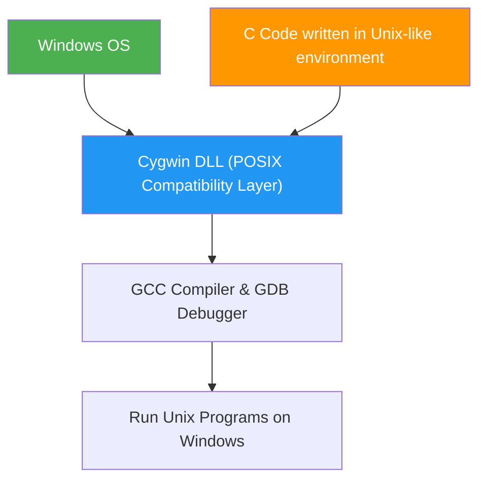

# My Background Study: Bits, Bytes, & Integers

The lecture material I reviewed covers the fundamental building blocks of computer science: Bits, Bytes, and Integers representation. To truly grasp this core content, I realized it's essential to understand the historical context and the contributions of the key figures who revolutionized computing.

## 1. The Founders of Computer Fundamentals: George Boole and Claude Shannon
The lecture explains why computers rely on binary (0 and 1). I found that this concept is deeply rooted in the work of mathematician George Boole and Claude Shannon, the father of information theory.

### A. George Boole and Boolean Algebra

- Background: George Boole, a 19th-century English mathematician, aimed to encode 'propositional logic' into a mathematical form, specifically Algebra.
- Core Principle: His creation, Boolean Algebra, expresses all logical relationships using only two values: True and False.
  - True is mapped to 1, and False is mapped to 0.
  - I realized this is the foundational mathematical basis for the bit operations (0 or 1) discussed in the lecture.
- Connection to the Lecture: The bitwise operators like AND, OR, NOT, and XOR explained in the lecture are simply digital implementations of the logical system established by Boole.

### B. Claude Shannon and Information Theory

- Background: Claude Shannon was a 20th-century American mathematician and electrical engineer, often called the 'father of information theory.' In his 1937 master's thesis, he proposed a revolutionary idea connecting Boolean algebra with practical digital circuit design. 
- Defining the Bit: In 1948, he defined the most fundamental unit of information as the bit. I learned that bit is an abbreviation for Binary Digit. 
- The First Link: Shannon demonstrated that the network of electromechanical relays used in complex systems like telephone switching could be systematically analyzed and designed using Boolean algebra. 
- Connection to the Lecture: The explanation of the origin of the 'bit' and how bit operations form the basis of physical circuit design, as covered early in the lecture, is all thanks to Shannon's pioneering work.

---

## 2. Why Do Modern Computers Use Binary?
The lecture materials contrast modern binary systems with the early use of decimal systems in large-scale computers to explain why 0s and 1s became the standard. 

### A. The ENIAC Decimal Approach

- ENIAC (Electronic Numerical Integrator and Computer): Developed in the 1940s, ENIAC was one of the first large-scale electronic computers.
  - It performed calculations using Vacuum Tubes.
  - I found that it used 10 vacuum tubes to represent a single decimal digit (0-9), with only one tube lit (On) at a time to signify the number. 
- The Decimal Limitation: Although decimal is familiar to humans, it was incredibly complex and inefficient to implement in hardware.

### B. Systemic Reasons for Choosing Binary

- Resistance to Noise and Imperfection: I realized the biggest reason modern computers use binary is stability.
  - By only using two extreme states, 0 (Off) and 1 (On), the system can reliably distinguish the signal as a definite 0 or 1, even if the actual electronic signal has bounce, noise, or imperfections. 
- Simplicity of System Design: Binary simplifies system design by allowing electronic devices like transistors to be used as simple On/Off switches, making complex circuitry highly efficient to construct.

---

## 3. Understanding the CMU 15-213 Course Context
This lecture material is part of Carnegie Mellon University's famous computer science course, '15-213: Introduction to Computer Systems.' Understanding this context helps me see why learning about 'bits' and 'bytes' is necessary.

### A. 15-213 Course Goal and Importance

- The Programmer's Perspective: This course deeply explores how computer systems execute programs, store information, and communicate, all from the programmer's point of view.
- Core Topics: It goes beyond high-level programming to provide low-level system knowledge, including computer arithmetic, memory management, machine-level code (assembly), and operating system principles.
- Objective: The ultimate goal is to make students better programmers, as this foundational knowledge is essential for solving complex bugs or optimizing program performance.

### B. Course Fundamentals

The course is based on the C language, but it's not just about syntax; it asks fundamental questions about how the computer interprets data.

- Interpretation of Bit Patterns: I learned that a bit pattern has no inherent meaning; its interpretation is determined by us—it could represent a number, a character, or code. 
- The Role of Data Types: Data types in C, like int or char, don't just determine size; they define the framework for interpretation—whether the bit pattern should be viewed as an 'Unsigned' integer or a 'Signed' integer using the 'Two's Complement' method. 
- Connection to the Lecture: This context explains why we must learn complex and specific rules like Two's Complement representation, shift operations, and type casting—because this is precisely how the actual computer system works.

---

## 4. Essential Tool for Labs: Cygwin
The professor mentioned 'Cygwin' for Windows users to complete the labs. I need to know what it is, as it's critical for setting up the required environment.

### A. Cygwin's Role

#### Providing a Unix-like Environment
Cygwin is a collection of software that implements a Linux/Unix-like environment within the Windows operating system.
This allows me to use familiar Unix command-line tools, such as the Bash shell.
Cygwin's motto is "Get that Linux feeling – on Windows."

#### POSIX API Compatibility
The core of Cygwin is a DLL (Dynamic-link Library) that emulates the POSIX (Portable Operating System Interface)—the standard system call API for Unix-like operating systems—by translating it to Windows system calls.

#### Includes C Compiler
Cygwin includes essential development tools like the GCC (GNU Compiler Collection) for C programming, so students can compile and run C code just as they would in a Linux environment.

### B. Connection to the Lecture
The professor mentioned that lab code might not work on a standard Windows machine and recommended using Cygwin to create a Unix-like environment.
This is because the CMU 15-213 course traditionally conducts labs based on a Linux/Unix system environment, and Cygwin serves as the essential bridge, allowing Windows users to easily replicate this environment.
I understand that installing Cygwin is mandatory to successfully complete the C programming labs provided in the course.